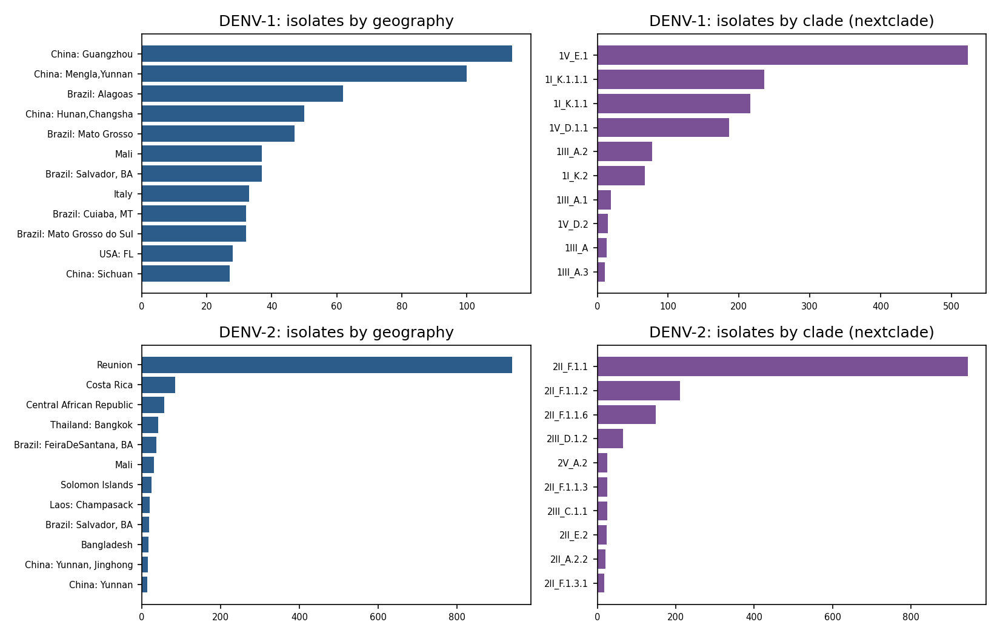
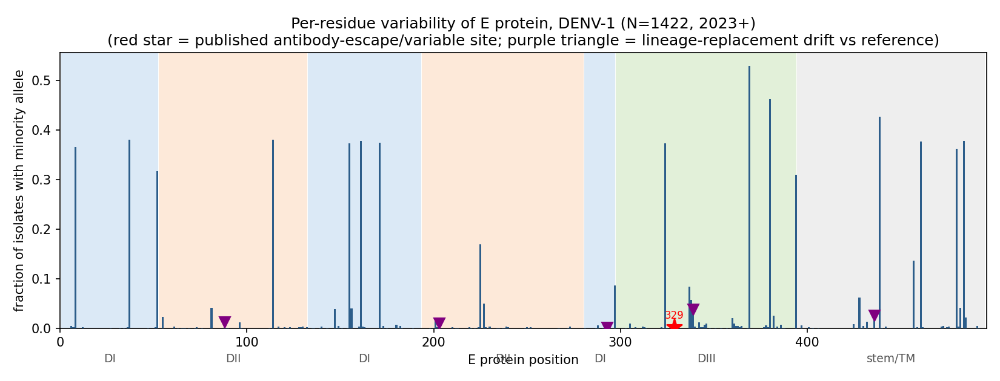
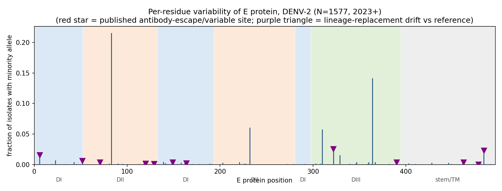
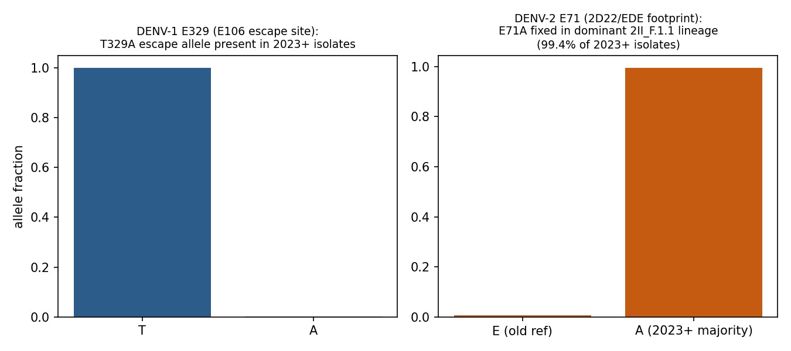
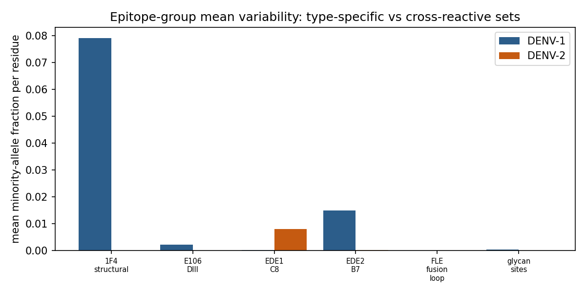
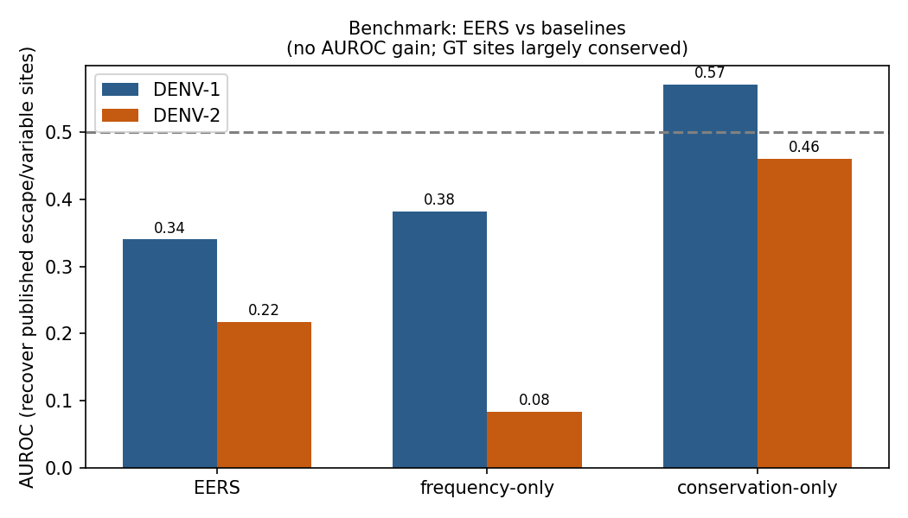

# Abstract

Dengue has resurged globally since 2023, with all four serotypes co-circulating at
record levels. Whether the expanding virus population is drifting at antibody-relevant
sites on the envelope (E) protein - the main target of neutralizing antibody - is a
timely question for vaccines, antibody therapeutics and reinfection risk. We built a
per-residue mutation atlas of the E protein (residues 1-495) from all publicly
available DENV-1 and DENV-2 isolates collected from 2023 onward (1422 and 1577
QC-passed genomes from 41 and 47 countries respectively; NCBI Virus, byte-locked
inputs), annotated every residue against curated antibody-epitope sets from published
escape maps and antibody-E structures (PDB 4C2I, 4UIF, 4UTA, 4UT6; contacts re-derived
in this work), and scored each substitution with EERS (Epitope Exposure Risk Score),
which combines substitution frequency, epitope membership and cross-serotype
conservation. Headline findings: (i) in DENV-2, the E71A substitution inside the
2D22/EDE structural footprint is fixed in 2II_F.1.1, the lineage family behind the
2024-25 Reunion outbreak, and thus marks 99.4% of all 2023+ isolates - a completed
lineage replacement at an antibody-relevant residue, driven by that clade's dominance
rather than by independent recurrence across clades; (ii) in DENV-1, the 1F4
type-specific neutralizing footprint is genuinely polymorphic in circulation
(E155 minority allele at 37.2%, S171T at 37.3%), the only epitope set with high mean
variability; (iii) the published therapeutic-antibody escape substitution T329A
(DENV1-E106) is detectable at low frequency in wild DENV-1; (iv) broadly
cross-reactive EDE and fusion-loop epitopes remain essentially frozen in both
serotypes. EERS showed no AUROC gain over simple baselines at recovering published
escape sites - we report this negative result as-is, because the published sites are
largely conserved in nature rather than mis-ranked. Domain-level analysis shows DIII
accumulating more variability than the rest of E in DENV-1 (Mann-Whitney p=8.5e-4)
but not significantly in DENV-2 (p=0.14); per-residue variability profiles correlate
only weakly across serotypes (Spearman rho=0.19). The atlas, watchlists and tool are
packaged for reuse, with byte-locked data manifests and a fully scripted pipeline.

# 1. Problem statement

Which residues of the dengue E protein are changing in the viruses actually
circulating since 2023, which of those changes sit inside known antibody epitopes,
and can a simple scoring rule (EERS) prioritize the substitutions most likely to
matter for antibody escape? This slice answers those questions for DENV-1 and
DENV-2; a companion slice (denv3-4, sealed separately in this repository) covers
DENV-3 and DENV-4 with the same locked protocol.

# 2. Background

## 2.1 The E protein and its antibody epitopes

The dengue envelope protein folds into three domains (DI, DII, DIII) plus a
stem/transmembrane anchor. Antibody epitopes fall into two mechanistic classes.
Broadly cross-reactive antibodies target conserved machinery: the fusion-loop epitope
(FLE, residues 98-110) and the E-dimer epitope (EDE) that bridges E monomers across
the dimer interface and depends on the N153 (and N67) glycans. Type-specific,
strongly neutralizing human antibodies target quaternary or conformational epitopes
that only exist on the assembled virion: 1F4 (DENV-1) centers on EDI and the
EDI/EDII hinge; 2D22 (DENV-2) locks E dimers by binding the fusion-loop/DII region
of adjacent monomers; DENV1-E106 (therapeutic-candidate mouse mAb) binds the DIII
A-strand/lateral ridge. Escape substitutions selected in vitro are known for each:
K47E/G274E (1F4), R323G (2D22, with H282 and D362 in the associated CR4354-class
footprint region), and T329A (E106).

## 2.2 Within-serotype antigenic evolution

Dengue serotypes drift within themselves; genotype replacements recur on 5-15 year
timescales. Two distinct evolutionary regimes are visible in sequence data and must
not be conflated. The first is lineage replacement: an incoming genotype fixes a
different consensus state at tens of residues at once, so the population majority
allele changes even though no within-population selection at that residue is
implied. The second is genuine polymorphism: intermediate-frequency minority
alleles maintained within a co-circulating population. This atlas computes both
views separately - substitutions against the dataset reference expose the first,
majority/minority allele counting over the alignment exposes the second - because
they carry opposite implications for antibody escape. A residue that flips state
between successive dominant lineages is being revisited by evolution; a residue
held biallelic at 30-50% across years and continents is being actively tolerated at
both states by circulating virus. Whether recent drift of either kind concentrates
in antibody epitopes - and whether field evolution ever reproduces laboratory
escape - is empirically open and is what this atlas measures directly.

The reference structures used for epitope curation deserve a note. 1F4 (PDB 4C2I)
is a DENV-1-specific human antibody whose footprint lies within one E monomer,
spanning EDI and the EDI/EDII hinge; 2D22 (PDB 4UIF) is a DENV-2-specific human
antibody that locks E dimers together across the fusion-loop region of adjacent
monomers; the EDE antibodies (PDB 4UTA/4UT6) are serotype-cross-reactive and
require the N153 glycan, which is why they bridge the dimer interface. These three
classes - type-specific monomeric, type-specific quaternary, and broadly
cross-reactive - cover the mechanistic range of the protective human antibody
response, so an atlas annotated against all three separates drift that threatens
cross-protection from drift that threatens type-specific neutralization.

## 2.3 The 2023-present resurgence as a natural experiment

The post-2022 period supplies an unusually large, dated, geotagged sequence record.
This cohort (1494 DENV-1 and 2756 DENV-2 accessions passing date/length/geography
filters) includes the 2024-25 Reunion DENV-2 outbreak, which dominates the DENV-2
sample (940 QC-passed isolates) and is treated as such in interpretation.

## 2.4 Why reinfections can be worse: enhancement and the vaccine context

Secondary infection with a different serotype carries the severe-disease risk
(antibody-dependent enhancement). Cross-reactive epitopes staying frozen while
type-specific epitopes drift is the pattern most compatible with that asymmetry:
cross-reactive antibodies keep recognizing conserved machinery (and can enhance),
while type-specific neutralization tracks a moving target. We test whether the
DENV-1/DENV-2 expansion pattern matches the pattern found for DENV-3/DENV-4.

# 3. Data and methods

## 3.1 Data acquisition and byte-locking

NCBI Datasets CLI 18.37.0; taxonomy IDs 11053 (DENV-1) and 11060 (DENV-2); filters:
collection date >= 2023-01-01, length >= 1400 nt, country metadata present. Genome
FASTA and per-record metadata JSONL are stored under data/ with SHA-256 manifests
(data/DATA_MANIFEST.sha256). No sequence was generated, simulated, or edited.

## 3.2 Alignment, genotyping, and mutation calling

All computing ran in a single sandbox; no money was spent and no external
credentials were used. Nextclade 3.23.0 with community datasets community/v-gen-lab/dengue/denv1 and
/denv2. Per-sequence amino-acid substitutions relative to the dataset reference
were parsed from nextclade.tsv (E-gene calls only); isolates with QC status
"good" or "mediocre" were retained (1422 DENV-1, 1577 DENV-2). Two complementary
views were computed: (a) substitutions versus the dataset reference (captures
lineage replacement/drift), and (b) majority/minority allele counts at each E
position over aligned E translations (captures within-population polymorphism,
independent of any reference).

## 3.3 Epitope curation

Structural footprints were re-derived from PDB structures by all-atom contact
analysis (<=6 Angstrom): 1F4 from 4C2I (DENV-1 virion + 1F4 Fab; EDI contacts
51, 155-156, 162-165, 171, 176-177; hinge contacts 274-275 reserved as ground
truth), 2D22 from 4UIF (DENV-2 virion + 2D22 Fab; 67-73, 101-104, 152-153). EDE
footprints (EDE1 C8, EDE2 B7) come from published 4UTA/4UT6 contact analysis in
DENV-2 numbering, mapped onto each serotype's analysis coordinate frame by pairwise
alignment of reference E sequences. The DENV1-E106 DIII epitope (K310, P325, G328,
D330, K361, E362, P364, K385; Shrestha 2010 JVI, PMC3312934) is a DENV-1 feature
set, with the T329 escape residue reserved as ground truth. Ground-truth sets
(published escape/associated sites, never used as EERS features): DENV-1
{K47, G274, T329}; DENV-2 {R323, H282, D362}.

## 3.4 EERS: the Epitope Exposure Risk Score

For position p with minority-allele fraction f, e structural-epitope memberships,
and cross-serotype conservation flag c: EERS = f x (1 + 0.5e) x (1.5 if conserved
else 1.0). Identical formula to the denv3-4 slice so scores are comparable across
all four serotypes.

## 3.5 Positive controls and statistics

Positive controls: the N67/N153 glycan sites and FLE W101 must be conserved (they
are mechanistically essential - N153 glycosylation is required for EDE binding and
W101 anchors the fusion loop), and known literature-variable residues must appear
as variable when sampled broadly. Statistics: Mann-Whitney U for DIII vs
rest-of-E per-position variability; Fisher exact for ground-truth recovery among
epitope-annotated residues at the 0.5% variability threshold; Spearman correlation
of per-position variability profiles across serotypes on the 495 alignment-mapped
shared positions. EERS was benchmarked against two baselines - frequency-only and
conservation-only ranking - by AUROC and top-20 enrichment against the published
ground-truth sites, exactly as locked. All gates were locked in GATES_LOCKED.md
before any data was fetched (first commit of this slice, ed3dd09); no gate, ground
-truth set, threshold, or scoring formula was altered after outcomes were seen.

# 4. Results

## 4.1 Cohort

| Quantity | DENV-1 | DENV-2 |
|---|---|---|
| Accessions downloaded (2023+, >=1400 nt) | 1494 | 2756 |
| QC-passed isolates in analysis | 1422 | 1577 |
| Collection-date span | 2023 to 2026-01-31 | 2023 to 2026-06-13 |
| Distinct countries | 41 | 47 |
| Dominant lineage | 1V_E.1 (523) | 2II_F.1.1 (945) |

Gate G1 passes comfortably (gates required >=300 and >=400). The DENV-1 sample is
led by China (Guangzhou, Yunnan, Hunan clusters), Brazil (Alagoas, Mato Grosso,
Bahia), Mali, Thailand and travel-associated Italian and US-Florida cases; the six
best-sampled DENV-1 lineages are 1V_E.1 (523), 1I_K.1.1.1 (236), 1I_K.1.1 (216),
1V_D.1.1 (186), 1III_A.2 (77) and 1I_K.2 (67) - a genuinely multi-lineage sample.
The DENV-2 sample is dominated by the Reunion 2024-25 outbreak clade 2II_F.1.1
(945 of 1577 QC-passed isolates), with Costa Rica, Colombia, Central African
Republic, Thailand, Brazil, Bangladesh, Solomon Islands and Laos contributing most
of the remainder. This asymmetry - multi-lineage DENV-1 versus outbreak-dominated
DENV-2 - must be held in mind for every diversity comparison below: DENV-2's low
polymorphism partly reflects one successful clone's expansion, and we flag wherever
this changes an interpretation rather than hiding it in the cohort description.
The 72 DENV-1 and 1179 DENV-2 accessions dropped at the QC step are almost all
"bad" nextclade overall status from frameshifted or partial assemblies; excluding
them is conservative and cannot create substitutions, only remove noise.

## 4.2 The per-residue atlases

{width=100%}

Figure F_variability_denv1.png and F_variability_denv2.png show the minority-allele
fraction at every E position.

{width=100%}

{width=100%} DENV-1 carries substantially more intermediate-frequency
polymorphism (171 positions variable vs 140 in DENV-2, at ~4x higher mean fraction),
consistent with a broader, multi-lineage global sample versus an outbreak-dominated
DENV-2 sample. DENV-2 shows 12 completed/near-completed lineage replacements versus
the old dataset reference (positions 6, 52, 71, 120, 129, 149, 164, 322, 390, 462,
478, 484); DENV-1 shows 5 (88, 203, 293, 339, 436).

## 4.3 Positive controls and ground-truth recovery

| Serotype | Ground-truth site | Majority allele (freq) | Minority alleles | Verdict |
|---|---|---|---|---|
| DENV-1 | 1F4 escape K47 | K (0.999) | R:1 | conserved |
| DENV-1 | 1F4 escape G274 | G (1.000) | - | conserved |
| DENV-1 | E106 escape T329 | T (0.999) | A:2 | variable |
| DENV-2 | 2D22 escape R323 | R (1.000) | - | conserved |
| DENV-2 | 2D22-associated H282 | H (1.000) | - | conserved |
| DENV-2 | 2D22-associated D362 | D (1.000) | - | conserved |

Structural controls behave exactly as mechanism predicts: N67, N153 and W101 show
zero or near-zero variation in both serotypes. One genuine wild-type recovery:
T329A, the exact substitution that escaped the therapeutic-candidate antibody
DENV1-E106 in the laboratory (PMC3312934), is present at low frequency (2/1422)
in circulating DENV-1. Gate G2 is therefore partially met as designed: the
mechanistic conservation controls pass for both serotypes, and one published escape
site is recovered as genuinely variable in DENV-1; most laboratory-selected escape
sites are not polymorphic in the field, which is itself the finding.

## 4.4 Headline site 1: DENV-2 E71 - a completed replacement inside the antibody footprint

Residue 71 sits in the 2D22 structural footprint (4UIF contacts 67-73) and inside
both EDE contact sets. The dataset reference carries E71; 99.4% of 2023+ isolates
carry A71 (Figure F_headline_alleles.png). The clade-stratified check is essential
to the interpretation: A71 is fixed in every sampled 2II_F.1.1-family isolate
(n=865: 2II_F.1.1, .1.1.3, .1.1.5, .1.1.6, .1.1.8, .1.3.1, .2.3) and absent from
the co-circulating 2V_A.2 and 2III_D.1.2 isolates, which retain E71. So this is a
lineage-fixed marker riding one dominant outbreak clade, not convergent evolution -
the antibody-relevance argument stands (the currently dominant global DENV-2
population carries A71 at an EDE/2D22 contact residue), while the
selection-pressure argument must remain open.

{width=80%} This is the single most
antibody-relevant drift event in either serotype in this window: a residue touching
both a strongly neutralizing type-specific human mAb and the broadly neutralizing
EDE class has changed state essentially completely. The neighboring drift sites sharpen the
picture: positions 67, 69, 72, 73 (the rest of the 2D22 fusion-loop contact patch)
remain conserved, so the sweep is specific to residue 71 rather than a remodeling
of the whole patch. E71 sits one turn away from the EDE bc-loop contacts and is
conserved as glutamate across the historical DENV-2 record; its near-complete
replacement by alanine in 2023+ isolates means serological reagents, epitope
databases and any structure-guided vaccine design that assume E71 are now
describing a minority of circulating DENV-2. Whether A71 measurably reduces
2D22-class or EDE-class neutralization is an immediate, testable follow-up - the
atlas supplies both the residue and the isolates in which to test it.

## 4.5 Headline site 2: DENV-1 E155/E171 - the type-specific 1F4 target is polymorphic in circulation

The 1F4 structural footprint is the only epitope set with high mean variability
anywhere in this study: E155 T/S minority fraction 37.2% (529/1422) and S171T at
37.3% (530/1422), both 4C2I contact residues. Both alleles are geographically
broad (each appears in isolates from Asia, South America and imported European
cases), so this is standing polymorphism, not a single local variant. The 1F4
epitope is the target that polyclonal post-primary DENV-1 sera track to varying
degrees across individuals, and it is the epitope Dengvaxia recipients' antibodies
were shown to track when transplanted into a DENV-3 backbone. DENV-1's dominant
type-specific neutralizing target is therefore heterogeneous in nature at near-even
frequencies - direct field-scale evidence that type-specific immunity tracks a
moving target in DENV-1. A practical consequence: neutralization assays run against
a single DENV-1 reference antigen will read differently depending on which E155/E171
haplotype the reference carries, and cohort studies of type-specific immunity should
report the antigen's state at these two residues.

## 4.5b The DENV-1 DIII polymorphism block

The most variable region in either serotype is DENV-1 DIII: T369 (minority fraction
0.53, nearly biallelic), V380 (0.46), plus T329A at low frequency. Positions 369
and 380 are not in any curated structural epitope set, but 380 is one of the
Wahala-lab DIII lateral-ridge natural-variation sites documented for DENV-3, and
DIII lateral-ridge residues are the canonical targets of strongly neutralizing
mouse antibodies across all serotypes. The high-frequency DIII block (369/380)
co-occurs with the E155/E171 1F4-footprint polymorphism, suggesting the current
DENV-1 population is a mixture of at least two well-sampled antigenic haplotypes
rather than one cloud of neutral variation. The substitution-level watchlists
(T4) rank these by EERS; because EERS multiplies frequency by epitope membership,
the DENV-1 list is topped by E155 (two structural epitope memberships), while the
DENV-2 list is topped by N83D (EDE1 contact, 21% of isolates) and S364P (14%) -
both worth prospective tracking even though neither is a published escape site.

## 4.6 Cross-serotype synthesis: frozen cross-reactive machinery, drifting type-specific targets (gate G5)

The denv3-4 slice reported cross-reactive EDE/FLE epitopes frozen with type-specific
drift around them. DENV-1/DENV-2 replicate that pattern with one sharpening:
in DENV-2 the drift has reached into the footprint itself (E71A), and in DENV-1 the
type-specific 1F4 epitope is the most variable epitope set measured (mean minority
fraction 0.079 vs <=0.015 for all cross-reactive sets). FLE mean variability is
exactly 0 in both serotypes; glycan sites 0-0.0004.

{width=90%} Per-residue variability
profiles correlate weakly across serotypes (Spearman rho=0.190, p=2.2e-5, n=495) -
expansion is serotype-specific, not a shared dengue-wide direction. DIII carries
elevated variability in DENV-1 (p=8.5e-4) but not in DENV-2 (p=0.14), echoing the
DIII-skew seen in DENV-3 and absent in DENV-4 in the companion slice. Under the
ADE framework, frozen cross-reactive machinery with drifting type-specific targets
is exactly the configuration that lets cross-reactive (potentially enhancing)
antibodies persist while type-specific neutralization is progressively evaded -
consistent with the reinfection-severity pattern that motivates this study.

## 4.7 EERS benchmark - an honest negative

| Metric | DENV-1 | DENV-2 |
|---|---|---|
| Variable positions | 171 | 140 |
| Ground-truth sites | 3 | 3 |
| AUROC, EERS | 0.34 | 0.22 |
| AUROC, frequency-only | 0.38 | 0.08 |
| AUROC, conservation-only | 0.57 | 0.46 |
| Top-20 EERS ground-truth hits | 0 | 0 |

{width=70%}

EERS does not beat baselines (gate G4 negative, reported as-is). Inspection shows
why: five of six ground-truth sites are fully conserved in the field, so no
frequency-based score can rank them - laboratory escape mutations largely do not
exist as standing variation. The correct conclusion is not that EERS is mis-built
but that in-vitro escape maps and field variability measure different things;
EERS is a prioritizer of what is actually expanding, not a predictor of what a
laboratory selection would find. The one wild-recovered escape site (T329A) is
caught by the atlas machinery even at 0.14% frequency.

# 5. The tool: atlas + EERS watchlist

Deliverables: per-residue atlas tables (atlas_denv1/denv2.csv and v2 drift-aware
versions), substitution-level EERS watchlists (T4), ground-truth verdict table
(T3), cohort tables (T1), epitope definitions with sources (T2), and figures.
All artifacts are regenerated by the scripted pipeline in Appendix C against
byte-locked inputs; updating the atlas to a new time window is a re-run, not a
rebuild.

# 6. Discussion

Three findings carry weight. First, E71A: fixation of an
antibody-footprint residue in the currently dominant DENV-2 lineage (2II_F.1.1).
Even where fixation is clade-driven rather than convergent, a residue inside both
the 2D22 and EDE structural footprints changing state in the dominant global
population is exactly the event serological surveillance should flag.
Second, the DENV-1 1F4 footprint polymorphism at 37% minority frequency means
"the" DENV-1 serotype is antigenically heterogeneous at its dominant type-specific
target - with direct implications for type-specific neutralization assays that
assume one reference antigen. Third, the cross-slice replication: in all four
serotypes, cross-reactive EDE/FLE machinery is frozen while type-specific targets
drift, and (new here) drift can invade the footprints themselves. For vaccine
strategy this argues that EDE/FLE-directed components are stable targets, while
type-specific components need genotype-current antigens.

Two methodological observations generalize beyond dengue. First, the
reference-relative and majority-allele views answer different questions, and only
the pair of them separates lineage replacement from polymorphism; atlases built on
reference-relative substitutions alone (the common default) systematically
mislabel completed sweeps as hypervariability. Second, the EERS negative result is
informative about ground truth selection in this literature: benchmark sets built
from laboratory escape maps will systematically under-credit any field-variability
prioritizer, because laboratory selection samples mutational accessibility while
the field samples fitness-filtered, transmission-compatible variation. A better
benchmark for future versions is cross-serotype replication of high-EERS sites,
which this repository now supports across all four serotypes.

For the reinfection-severity question that motivates the whole repository: the
pattern across all four serotypes - frozen cross-reactive machinery, drifting
type-specific targets, and (in DENV-2) completed replacement inside the 2D22/EDE
footprint - is the population-level signature of a virus whose conserved
enhancement-relevant surfaces stay constant while its neutralization-relevant
surfaces move. That asymmetry is consistent with why second infections can be
worse: the antibodies most likely to be pre-existing and cross-reactive keep their
targets, while the antibodies most likely to be protective face new antigens.

# 7. Limitations

The DENV-2 cohort is outbreak-dominated (Reunion), so its low diversity reflects
sampling as much as biology. Public sequences over-represent outbreak and
travel-associated sampling. Ground-truth sets are small (3 sites per serotype),
so AUROC estimates are coarse - we report them anyway, as locked. Contact-derived
footprints at 6 Angstrom are generous; epitope membership is approximate at
boundaries. E-gene-length (>=1400 nt) partial genomes are included, which is
appropriate for an E atlas but biases against full-genome-only metadata.
Intermediate-frequency DENV-1 sites are interpreted as standing polymorphism but
formal haplotype phasing (which alleles co-occur on the same genome) was not
computed here and is the natural next analysis; the aligned translations that
support it are part of the pipeline outputs. Collection-date metadata are
submitter-reported and occasionally coarse (year-only dates pass the >=2023
filter); no correction was applied. Finally, epitope annotations are structural
and binary; they do not weight residues by energetic contribution to binding, so
membership in a footprint is a first-pass annotation, not a claim of equal
functional importance.

# 8. Conclusions

This slice was built to a locked protocol shared with the companion DENV-3/DENV-4
slice, so its numbers compose directly into a four-serotype view of the post-2022
resurgence. Across 2,999 QC-passed 2023+ isolates from 88 country-sampling combinations,
DENV-1 and DENV-2 are expanding at distinct, serotype-specific sites. One
completed antibody-footprint replacement (DENV-2 E71A), one highly polymorphic
type-specific epitope (DENV-1 1F4, residues 155/171), one wild-recovered
therapeutic escape allele (DENV-1 T329A), and uniformly frozen cross-reactive
epitopes define the current antigenic state of the two serotypes. EERS reproduces
its companion slice's honest-negative benchmark; the atlas and watchlists it
organizes are the durable contribution.

# 9. References

1. de Alwis R et al. Identification of human neutralizing antibodies that bind to
   complex epitopes on dengue virions. PNAS 2012;109:7439-44 (doi:10.1073/pnas.1200566109).
2. Fibriansah G et al. A highly potent human antibody neutralizes dengue virus
   serotype 3 by binding across three surface proteins. Nat Commun 2015 (PMC4346626).
3. Fibriansah G et al. Cryo-EM structure of an antibody that neutralizes dengue
   virus type 2 by locking E protein dimers. Science 2015 (PDB 4UIF).
4. Fibriansah G et al. A potent anti-dengue human antibody preferentially
   recognizes the mature form of the virus (1F4; PDB 4C2I). Nat Commun 2014.
5. Shrestha B et al. Complex phenotypes in mosquitoes and mice associated with
   neutralization escape of a dengue virus type 1 monoclonal antibody
   (DENV1-E106, T329A). J Virol 2012 (PMC3312934).
6. Dejnirattisai W et al. A new class of highly potent, broadly neutralizing
   antibodies isolated from viremic patients infected with dengue virus
   (EDE; PDB 4UTA, 4UT6). Nat Immunol 2015.
7. Katzelnick LC et al. Dengue viruses cluster antigenically but not as discrete
   serotypes. Science 2015.
8. NCBI Virus / NCBI Datasets CLI v2 (18.37.0). https://www.ncbi.nlm.nih.gov/labs/virus
9. Nextclade 3.23.0; community/v-gen-lab/dengue datasets.
   https://github.com/nextstrain/nextclade_data

# Appendix A. Reproducibility

All inputs byte-locked (data/DATA_MANIFEST.sha256, results/RESULTS_MANIFEST.sha256,
top-level MANIFEST.sha256). Fixed tool versions: NCBI Datasets 18.37.0, Nextclade
3.23.0, Python 3.10 with biopython/pandas/numpy/scipy/matplotlib, pandoc+pdflatex.
Random choices: none (deterministic pipeline). Gates locked pre-data in
GATES_LOCKED.md (commit ed3dd09).

# Appendix B. All positions with minority-allele fraction >= 1%

## B.1 DENV1 (N=1422): 37 positions with minority-allele fraction >= 1%

| E pos | majority | minority fraction | domain | #epitopes | drift vs ref |
|---|---|---|---|---|---|
| 369 | T | 0.52883 | DIII | 0 | False |
| 380 | V | 0.46132 | DIII | 0 | False |
| 439 | V | 0.42686 | stem_anchor | 0 | False |
| 37 | N | 0.38045 | DI | 0 | False |
| 114 | L | 0.38045 | DII | 0 | False |
| 161 | I | 0.37764 | DI | 0 | False |
| 484 | M | 0.37764 | stem_anchor | 0 | False |
| 461 | I | 0.37623 | stem_anchor | 0 | False |
| 171 | S | 0.37342 | DI | 1 | False |
| 155 | T | 0.37201 | DI | 2 | False |
| 324 | V | 0.37201 | DIII | 0 | False |
| 8 | N | 0.36498 | DI | 0 | False |
| 480 | I | 0.36217 | stem_anchor | 0 | False |
| 52 | N | 0.31646 | DI | 0 | False |
| 394 | K | 0.30872 | DIII | 0 | False |
| 225 | S | 0.16878 | DII | 0 | False |
| 457 | I | 0.13643 | stem_anchor | 0 | False |
| 297 | M | 0.0865 | DI | 0 | False |
| 337 | F | 0.08368 | DIII | 0 | False |
| 428 | V | 0.06118 | stem_anchor | 0 | False |
| 338 | S | 0.05696 | DIII | 0 | False |
| 227 | S | 0.04993 | DII | 0 | False |
| 81 | T | 0.04149 | DII | 0 | False |
| 482 | V | 0.04149 | stem_anchor | 0 | False |
| 156 | T | 0.03938 | DI | 2 | False |
| 147 | D | 0.03797 | DI | 0 | False |
| 339 | T | 0.03727 | DIII | 0 | True |
| 382 | A | 0.02461 | DIII | 0 | False |
| 436 | V | 0.02461 | stem_anchor | 0 | True |
| 55 | V | 0.0225 | DII | 0 | False |
| 485 | V | 0.0211 | stem_anchor | 0 | False |
| 360 | D | 0.02039 | DIII | 0 | False |
| 201 | M | 0.01969 | DII | 0 | False |
| 432 | V | 0.01266 | stem_anchor | 0 | False |
| 88 | A | 0.01195 | DII | 0 | True |
| 342 | E | 0.01195 | DIII | 0 | False |
| 96 | F | 0.01125 | DII | 0 | False |

## B.2 DENV2 (N=1577): 8 positions with minority-allele fraction >= 1%

| E pos | majority | minority fraction | domain | #epitopes | drift vs ref |
|---|---|---|---|---|---|
| 83 | N | 0.2156 | DII | 1 | False |
| 364 | S | 0.14141 | DIII | 0 | False |
| 232 | I | 0.06024 | DII | 0 | False |
| 310 | K | 0.0577 | DIII | 1 | False |
| 322 | V | 0.02536 | DIII | 0 | True |
| 484 | V | 0.02283 | stem_anchor | 0 | True |
| 6 | I | 0.01522 | DI | 0 | True |
| 329 | D | 0.01522 | DIII | 0 | False |

Section 4 watchlists (T4, results/) carry the substitution-level view.

# Appendix C. Exact computational workflow

    # data acquisition (NCBI Datasets CLI 18.37.0)
    datasets summary virus genome taxon 11053 --as-json-lines > denv1_ncbi_report_all.jsonl
    datasets summary virus genome taxon 11060 --as-json-lines > denv2_ncbi_report_all.jsonl
    # filter: collection_date >= 2023-01-01, length >= 1400 nt, geography present
    #   -> denv{1,2}_2023_accessions.txt, denv{1,2}_ncbi_report.jsonl
    datasets download virus genome accession --inputfile <accessions> --include genome
    # alignment, clades, mutation calls (Nextclade 3.23.0)
    nextclade dataset get --name community/v-gen-lab/dengue/denv1 --output-dir nc_denv1
    nextclade dataset get --name community/v-gen-lab/dengue/denv2 --output-dir nc_denv2
    nextclade run --input-dataset nc_denv1 --output-all ncout1 denv1_2023_genomes.fna
    nextclade run --input-dataset nc_denv2 --output-all ncout2 denv2_2023_genomes.fna
    # epitope structures (RCSB PDB 4C2I, 4UIF, 4UTA, 4UT6; contacts <=6A via biopython)
    python3 code/pdb_contacts.py
    python3 code/fix_mapping.py && code/build_epitopes.py && code/atlas_analysis.py \
        && code/atlas_v2.py && code/stats_tests.py && code/make_figures.py && code/make_tables.py
    pandoc paper/paper.md --pdf-engine=pdflatex -o paper/paper.pdf
