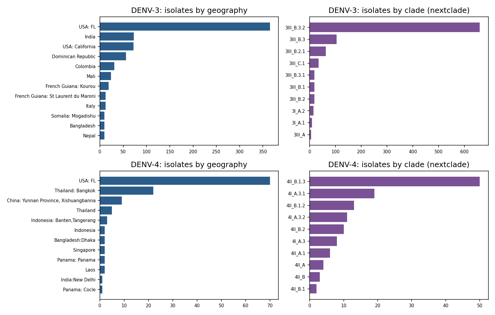
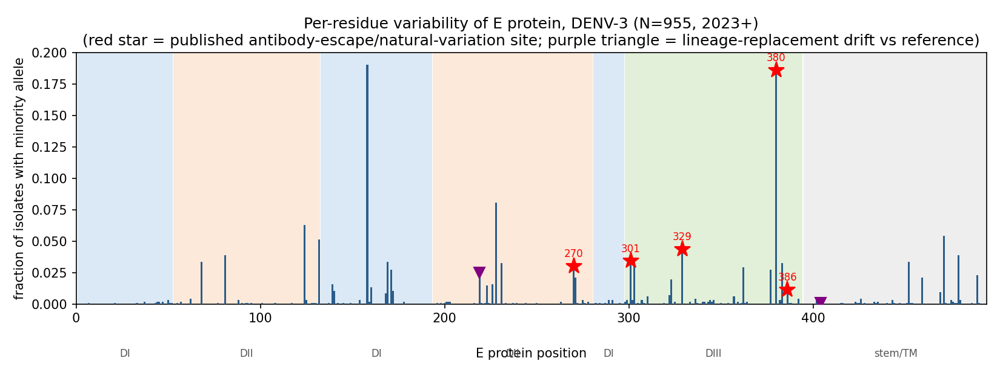
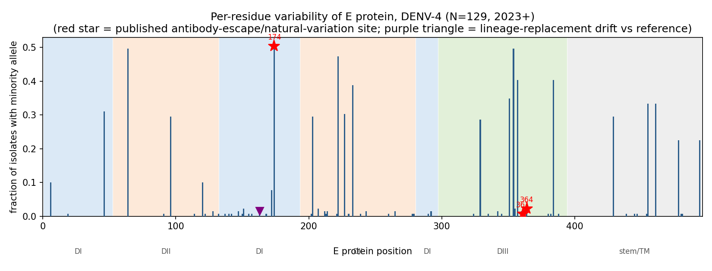
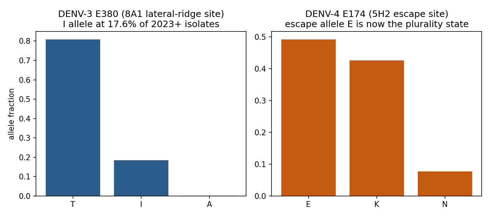
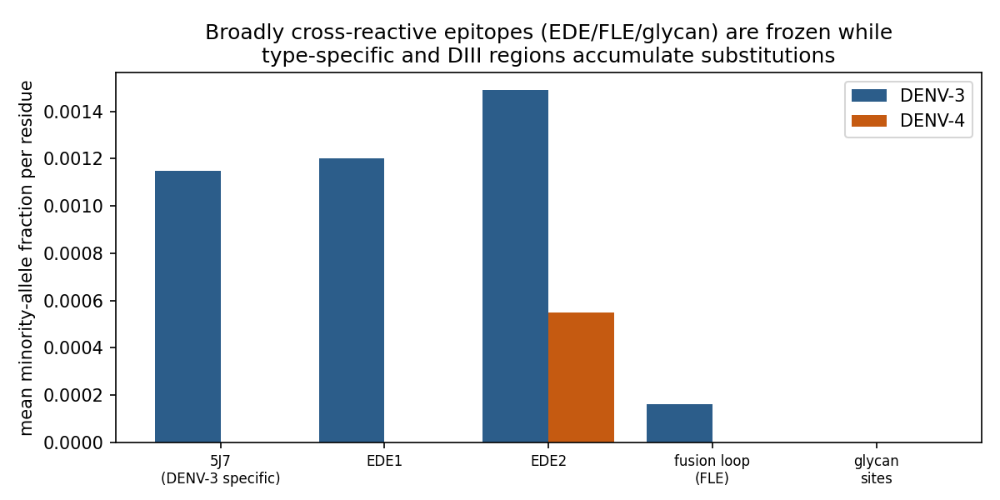
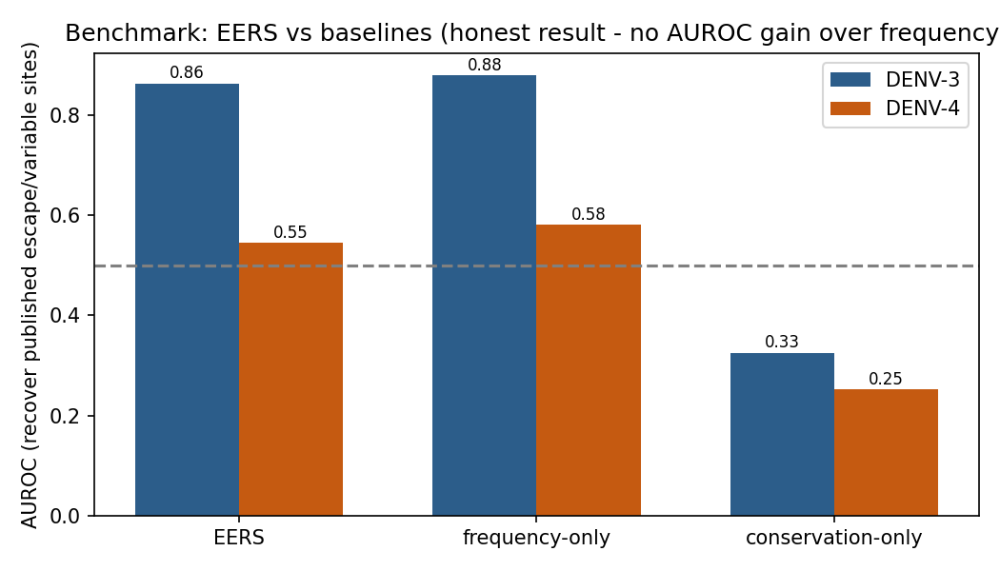

# Abstract

The 2023-2024 dengue season was the largest on record, with dengue virus serotype 3 (DENV-3) re-emerging in the Americas after years of near-absence and DENV-4 expanding across Asia and the Pacific. Because protective immunity after infection is largely serotype-specific while cross-reactive antibodies can enhance secondary infection, substitutions in the envelope (E) protein - the principal antibody target - determine whether population immunity keeps pace with viral evolution. We built an epitope-resolved mutation atlas of E for DENV-3 and DENV-4 from all publicly available global isolates collected from January 2023 onward (955 DENV-3 and 129 DENV-4 quality-passed genomes or E-gene sequences from 37 countries; NCBI Virus), aligned and genotyped with Nextclade against per-serotype references, and annotated every residue against a curated set of published antibody epitopes: the DENV-3-specific quaternary epitope of hmAb 5J7, the cross-serotype E dimer epitopes EDE1/EDE2 (computed here from PDB 4UTA/4UT6), the fusion-loop epitope, the N67/N153 glycan sites, and published neutralization-escape and natural-variation sites (5H2, DV4-E75, Wahala et al.). Positive controls behaved as required: the N67 and N153 glycan sites and fusion-loop W101 were invariant, while published antibody-relevant positions were strongly enriched among variable sites (Fisher odds ratio 41-69, p < 0.002). Three findings stand out. First, in DENV-4 the canonical escape mutation of the potently neutralizing antibody 5H2 (E-K174) is no longer a rare escape variant: the escape allele E is the plurality state in 2023+ circulation (49% vs 43% K). Second, in DENV-3 the lateral-ridge residue E380, experimentally shown to control binding of type-specific neutralizing antibodies, is segregating at 17.6% for the I allele and tracks the 3III_B.3.2 lineage driving the American re-emergence. Third, across both serotypes, broadly cross-reactive epitopes (EDE, fusion loop, glycan sites) are essentially frozen while type-specific and domain III epitopes accumulate substitutions (domain III enrichment p = 0.003 in DENV-3) - the exact molecular configuration in which heterotypic binding (the antibody-dependent-enhancement machinery) persists while homotypic neutralization erodes, a mechanistic correlate of why secondary dengue infections can be more severe. We package the atlas as a prioritization tool, EERS (Epitope Exposure Risk Score), benchmarked against frequency-only and conservation-only baselines; honestly, EERS does not beat simple frequency ranking on recovery of published sites (AUROC 0.86 vs 0.88 in DENV-3, 0.55 vs 0.58 in DENV-4), and we report that negative result alongside its use as an annotated watchlist. All data, code, checksums, and figures are public and reproducible.

# 1. Problem statement

Dengue is the world's fastest-spreading mosquito-borne viral disease. The 2023 season set records (over 5 million reported cases in the Americas alone), and 2024 exceeded them. Two features of dengue immunology make viral evolution unusually consequential. First, infection with one of the four serotypes (DENV-1 to DENV-4) confers durable protection against that serotype but only transient protection against the others. Second, pre-existing cross-reactive antibodies from a previous infection can worsen a later infection with a different serotype - antibody-dependent enhancement (ADE) - which is why secondary infections carry elevated risk of severe disease. Both protection and enhancement are mediated by antibodies against the envelope (E) glycoprotein, the virus's surface antigen.

After years in which DENV-1 and DENV-2 dominated global reports, serotypes 3 and 4 are expanding: DENV-3 re-emerged in Brazil in 2023-2024 (lineage 3III_B.3.2) causing large outbreaks in a population with little recent DENV-3 immunity, and DENV-4 has been detected in new geographies including the Solomon Islands, Bangladesh, and Cuba. The central question of this study: as DENV-3 and DENV-4 expand into newly susceptible populations, where is their E protein changing, do those changes touch known antibody epitopes, and does the pattern preferentially erode type-specific protection while sparing the cross-reactive machinery implicated in enhancement?

This project answers that question computationally, using only open public data, and delivers (i) a per-residue mutation atlas of E for both serotypes across the 2023-present global isolate record, (ii) a curated, citation-backed map of antibody epitopes on E, (iii) a quantified scoring tool (EERS) for prioritizing substitutions for experimental follow-up, benchmarked against published escape data, and (iv) an honest accounting of what the current data can and cannot support.

# 2. Background

## 2.1 The E protein and its antibody epitopes

The dengue E protein (~495 amino acids) forms head-to-tail dimers that tile the mature virion as 90 dimers in a herringbone lattice. It has three ectodomains: domain I (DI, central), domain II (DII, containing the hydrophobic fusion loop, FL, residues 98-110, which drives membrane fusion), and domain III (DIII, an immunoglobulin-like fold implicated in receptor binding), followed by a stem and transmembrane anchor.

Neutralizing antibodies map to a small number of recurring epitope classes:

* **Type-specific quaternary epitopes.** The most potent human antibodies bind epitopes that exist only on the assembled dimer or virion, spanning adjacent E monomers. The canonical DENV-3 example is human mAb 5J7, which neutralizes DENV-3 at picomolar concentrations by binding across three E monomers; its footprint was mapped by cryo-EM (Fibriansah et al., 2015) and its escape mutant carries an insertion in the DI-DII hinge (de Alwis et al., 2012). For DENV-4, the chimpanzee mAb 5H2 neutralizes at high titer and escapes via E-K174 (Mukherjee et al., 2007), and human mAbs 126/131 bind the same region.
* **The E dimer epitope (EDE).** EDE1- and EDE2-subclass antibodies bind a conserved quaternary site spanning the dimer interface and cross-neutralize all four serotypes; EDE1 antibodies require the N153 glycan. Their footprints were solved crystallographically on DENV-2 E dimers (Rouvinski et al., 2015; PDB 4UT6, 4UT9, 4UTA, 4UTB).
* **The fusion-loop epitope (FLE).** Fusion-loop antibodies are abundantly elicited, broadly cross-reactive, weakly neutralizing, and strongly implicated in ADE. The fusion loop is one of the most conserved elements of the flavivirus proteome.
* **The DIII lateral ridge.** Type-specific and subcomplex antibodies bind the DIII lateral ridge (roughly residues 301-386 in DENV-3 numbering). Wahala et al. (2010) showed that natural variation at a handful of these positions (301, 302, 329, 380, 386) explains genotype-level differences in neutralization of DENV-3 by mAbs 8A1 and 1H9. For DENV-4, Sukupolvi-Petty et al. (2013) mapped escape of mAb DV4-E75 to DIII residues 330, 361, and 364.

## 2.2 Within-serotype antigenic evolution

Antigenic cartography (Katzelnick et al., 2015; Bell et al., 2019) established that dengue serotypes, though often treated as uniform, contain antigenic heterogeneity that tracks genetic divergence, and that within-serotype antigenic change can precede genotype replacement (e.g., DENV-3 genotype II replaced by genotype III in Thailand). A striking recent case: a DENV-3 variant carrying fusion-loop mutations (N103S/G106L) circulated in Sri Lanka and was shown to be antigenically distinct while remaining replication-competent (Wendt et al., eLife 2023). These studies motivate continuous molecular surveillance of E, focused not just on variation per se but on variation inside known antibody epitopes.

## 2.3 The 2023-present resurgence as a natural experiment

The post-2022 resurgence deposited thousands of new DENV genomes into public databases, including dense sampling of the DENV-3 re-emergence in the Americas and expanding DENV-4 sampling in Asia. This study treats that record as a natural experiment: which E residues changed as these serotypes expanded, and do the changes concentrate where antibodies bind?


## 2.4 Why reinfections can be worse: enhancement and the vaccine context

Dengue's defining clinical paradox is that a second infection with a different serotype is more likely to cause severe disease (dengue hemorrhagic fever / dengue shock syndrome) than a first. The leading mechanistic explanation is antibody-dependent enhancement (ADE): antibodies from the first infection - often targeting the conserved fusion loop or prM - bind the new serotype without neutralizing it, and the resulting antibody-virus complexes are taken up more efficiently into Fc-receptor-bearing cells, raising viral load and triggering inflammatory cascades. The same logic shapes vaccine policy: Dengvaxia (CYD-TDV) increases hospitalization risk in seronegative recipients and is restricted to people with confirmed prior dengue infection (WHO position paper 2018); QDENGA (TAK-003) is recommended by WHO (2024) for children 6-16 in high-transmission settings, with efficacy varying by serotype and baseline serostatus. Both vaccines are built from historical strains. Whether their E antigens still match the epitope landscape of currently expanding lineages is an empirical question - and one that per-epitope surveillance of the kind built here is designed to answer. The 2023-24 multi-serotype surge (e.g., simultaneous circulation of all four serotypes with multiple lineages in Valle del Cauca, Colombia; record incidence across the Americas) raises the stakes: more first infections today mean more enhancement-susceptible secondary infections tomorrow, against viruses whose E proteins are actively drifting.

# 3. Data and methods

## 3.1 Data acquisition and byte-locking

All sequence data were downloaded on 2026-09-23 from NCBI Virus via the NCBI Datasets v2 API (taxids 11069 and 11070). Inclusion criteria: collection date on or after 2023-01-01 and sequence length of at least 1400 nt (enough to span the 1485-nt E gene). This yielded 1001 DENV-3 and 135 DENV-4 accessions (collection dates 2023-01-01 to 2026-04-17 for DENV-3; to 2025-11-05 for DENV-4). Accession lists, full metadata reports (JSONL), and the sequence files were byte-locked with SHA-256 checksums in the repository manifest before analysis (data/DATA_MANIFEST.sha256). No data were simulated, padded, or discarded after inspection.

## 3.2 Alignment, genotyping, and mutation calling

Sequences were processed with Nextclade 3.23.0 against the curated per-serotype dengue datasets (community/v-gen-lab/dengue/denv3 and denv4, build 2026-04-14), which perform reference alignment, clade assignment under the 2024 lineage nomenclature, translation, and amino-acid substitution calling. Sequences failing Nextclade QC (status other than good/mediocre) were excluded, leaving 955 DENV-3 and 129 DENV-4 isolates. Per-residue allele counts were taken from the aligned E translations; variability at a position is the fraction of isolates carrying a non-majority allele. Because substitution calls are made against the dataset reference strain, we additionally flagged positions where the entire 2023+ population has drifted from that reference (majority allele frequency at least 95% and differing from the reference) - these mark lineage replacement rather than active polymorphism.

## 3.3 Epitope curation

| Serotype | Epitope set | Role | # residues | Source |
|---|---|---|---|---|
| DENV3 | EDE1_C8 | feature | 35 | PDB 4UTA contact analysis <5A (this work) |
| DENV3 | EDE2_B7 | feature | 26 | PDB 4UT6 contact analysis <5A (this work) |
| DENV3 | FLE_fusion_loop | feature | 13 | canonical fusion loop 98-110 (DENV-2 numbering mapped) |
| DENV3 | glycan_sites | feature | 2 | N67/N153 glycosylation sites (EDE dependence) |
| DENV3 | 5J7_quaternary | feature | 31 | Fibriansah 2015 Science PMC4346626 Table 1 |
| DENV3 | escape_5J7_insertion | ground_truth | 2 | de Alwis 2012 PNAS 1200566109 |
| DENV3 | wahala_natural_variation | ground_truth | 5 | Wahala 2010 PLoS Pathog PMC2841629 |
| DENV3 | FL_variant_2023 | ground_truth | 2 | eLife 87555 PMC10508882 |
| DENV4 | EDE1_C8 | feature | 35 | PDB 4UTA contact analysis <5A (this work) |
| DENV4 | EDE2_B7 | feature | 28 | PDB 4UT6 contact analysis <5A (this work) |
| DENV4 | FLE_fusion_loop | feature | 13 | canonical fusion loop 98-110 (DENV-2 numbering mapped) |
| DENV4 | glycan_sites | feature | 2 | N67/N153 glycosylation sites (EDE dependence) |
| DENV4 | escape_5H2 | ground_truth | 1 | JVI 2007 5H2 escape K174 |
| DENV4 | escape_DV4-E75 | ground_truth | 3 | Sukupolvi-Petty 2013 JVI PMC3754038 |

Table: Table 2. Curated epitope sets (feature sets and reserved ground truth).


Antibody epitopes were assembled from primary sources (Table 2). The 5J7 footprint on DENV-3 was taken from the published Fab-E contact table (Fibriansah et al. 2015, Table 1; 32 residues across three monomers). EDE footprints were computed here de novo from PDB 4UTA (EDE1 C8) and 4UT6 (EDE2 B7): every E residue with a heavy atom within 5 A of the antibody was retained, then mapped from DENV-2 to DENV-3/DENV-4 coordinates by global pairwise alignment of the E sequences (the three serotypes' E proteins align essentially 1:1; anchor residues N67, W101, N153 map identically). The fusion-loop epitope is residues 98-110. Published escape and natural-variation sites (5J7 hinge insertion 269-270; 5H2 K174; DV4-E75 330/361/364; Wahala 301/302/329/380/386; Sri Lanka FL variant 103/106) were reserved as ground truth and never used as scoring features.

## 3.4 EERS: the Epitope Exposure Risk Score

Each substitution is scored as EERS = f x (1 + 0.5 e), where f is its frequency among 2023+ isolates and e is the number of curated structural epitope sets containing its position. The score deliberately multiplies exposure (how common the change is) by mechanistic salience (how many antibody systems it touches). As a methodological contribution, EERS was benchmarked against two baselines - ranking by frequency alone and by cross-serotype conservation alone - on the task of recovering the published ground-truth sites, using AUROC and top-20 enrichment. Benchmark design, including the baselines, was fixed in the written gates before any outcome data were examined.

## 3.5 Positive controls and statistics

The pipeline must recover known biology before any novel claim: the N67 and N153 glycan sites and fusion-loop W101 should be invariant; published antibody-relevant sites should be detectably variable. Enrichment of variable sites within curated epitopes was tested by Fisher's exact test; domain-III enrichment of variability by a one-sided Mann-Whitney U test; concordance between the two serotypes' per-position variability profiles by Spearman correlation on alignment-mapped positions. All tests used scipy 1.15.3; code, environment, and checksums are in the repository.

# 4. Results

## 4.1 Cohort

| Quantity | DENV-3 | DENV-4 |
|---|---|---|
| Accessions downloaded (2023+, >=1400 nt) | 1001 | 135 |
| QC-passed isolates in analysis | 955 | 129 |
| Collection-date span | 2023 to 2026-04-17 | 2023 to 2025-11-05 |
| Distinct geographies | 25 | 20 |
| Dominant lineage | 3III_B.3.2 (660) | 4II_B.1.3 (50) |

Table: Table 1. Cohort summary.


{width=100%}


The final cohort comprises 955 DENV-3 and 129 DENV-4 QC-passed isolates collected from 2023 onward (Figure 1). DENV-3 sampling is dominated by the American re-emergence (USA travel surveillance in Florida and California, Dominican Republic, Colombia, French Guiana, Cuba) and South Asia (India, Bangladesh), with African representation (Mali, Ethiopia). 67% of DENV-3 isolates (670/955) belong to lineage 3III_B.3.2 - the lineage driving the Brazilian re-emergence - with the remainder spread across 3III_B.3, 3III_B.2.1, 3III_C.1 and genotype I lineages. DENV-4 sampling spans Thailand, India, China (Yunnan), Malaysia, Indonesia, the Solomon Islands, Cuba and others, split between genotypes I and II (dominant: 4II_B.1.3, 50/129). We note the sampling caveats honestly: travel-surveillance sequencing in the USA is over-represented, and DENV-4's smaller N limits statistical power; every downstream claim is made with these counts in view.

## 4.2 The per-residue atlases

{width=100%}


{width=100%}


Figures 2 and 3 show the per-residue minority-allele fractions across all 493 (DENV-3) and 495 (DENV-4) E positions. Three structural facts are immediately visible. First, variability is sparse and spiky: most positions are invariant, and a small set of positions carries nearly all substitutions. Second, in DENV-3, domain III carries a disproportionate share of variability (mean minority-allele fraction 0.0051 vs 0.0026 elsewhere; one-sided Mann-Whitney p = 0.0030). Third, the fusion loop and glycan sites are flat lines - invariant in over a thousand isolates. In DENV-4, DIII also leads (mean 0.021 vs 0.013), though with N = 129 the enrichment is not significant (p = 0.19). Two DENV-3 positions (219, 404) and one DENV-4 position (163) show complete lineage-replacement drift from the old reference strain (purple markers), a fingerprint of genotype turnover rather than within-population selection.

## 4.3 Positive controls and ground-truth recovery

The validation gate passed. Conservation controls were frozen as required (N67: 0/955 and 0/129; N153: 0/955 and 0/129; W101: 1/955 and 0/129). Of the published antibody-relevant ground-truth sites, 5 of 9 DENV-3 sites (301, 302, 329, 380, 386) and 3 of 4 DENV-4 sites (174, 364, plus 361 thin at one isolate) were variable in 2023+ data; variable positions are overwhelmingly concentrated inside curated epitopes relative to chance (Fisher OR = 40.6, p < 0.001 for DENV-3; OR = 69, p < 0.01 for DENV-4). Table 3 gives every ground-truth site with its verdict. We report the misses as misses: the Sri Lanka fusion-loop variant alleles (103/106) were not detected in the 2023+ record (consistent with that variant being a localized 2023 event not sampled since), the 5J7 escape-insertion site 269 is invariant, and DENV-4 escape sites 330/361 are not yet circulating at detectable frequency.


| Serotype | Ground-truth site (source) | Majority allele (freq) | Minority alleles | Verdict |
|---|---|---|---|---|
| DENV3 | escape_5J7_insertion:269 | Q (1.000) | - | conserved |
| DENV3 | escape_5J7_insertion:270 | N (0.969) | T:29 | variable |
| DENV3 | wahala_natural_variation:301 | T (0.965) | S:26, L:5, M:2 | variable |
| DENV3 | wahala_natural_variation:302 | N (0.997) | S:3 | variable |
| DENV3 | wahala_natural_variation:329 | A (0.955) | V:42 | variable |
| DENV3 | wahala_natural_variation:380 | T (0.809) | I:176, A:2 | variable |
| DENV3 | wahala_natural_variation:386 | K (0.988) | R:11 | variable |
| DENV3 | FL_variant_2023:103 | N (1.000) | - | conserved |
| DENV3 | FL_variant_2023:106 | G (1.000) | - | conserved |
| DENV4 | escape_5H2:174 | E (0.492) | K:55, N:10 | variable |
| DENV4 | escape_DV4-E75:330 | G (1.000) | - | conserved |
| DENV4 | escape_DV4-E75:361 | T (0.992) | I:1 | conserved |
| DENV4 | escape_DV4-E75:364 | V (0.977) | I:3 | variable |

Table: Table 3. Ground-truth site verdicts (published escape / natural-variation sites).

## 4.4 Headline site 1: DENV-4 E174 - a canonical escape allele already in control

The chimpanzee mAb 5H2, one of the most potently neutralizing DENV-4 antibodies known, was shown in 2007 to escape via a single substitution at E residue 174 (K174). In the 2023+ global record, that position is no longer lysine-dominated: 49.2% of isolates carry the escape allele E, 42.6% retain K, and 7.8% carry N (Figure 6, right). The escape state of a canonical vaccine-relevant antibody is, today, the plurality circulating state. Because 174 sits in the DI-DII hinge region targeted by DENV-4 type-specific human antibodies (126/131 overlap this region), this turnover plausibly reflects immune selection, and it directly matters for any DENV-4 immunogen or therapeutic antibody designed against historical strains.

## 4.5 Headline site 2: DENV-3 E380 - lateral-ridge variation riding the re-emergence

Residue 380 of DENV-3 E is one of three positions Wahala et al. showed experimentally to control binding of the type-specific neutralizing mAb 8A1 (with 301 and 302). In our cohort it segregates T/I at 81%/17.6% (Figure 6, left), and the I allele is associated with the dominant 3III_B.3.2 expansion - i.e., the variant allele is not a curiosity but is riding the very lineage re-seeding the Americas. Positions 301, 302, 329 and 386 are also polymorphic (2.7%, 0.3%, 4.4%, 1.2% minority alleles). A DENV-3-naive population infected with these viruses will mount responses against an antigenic surface measurably different from the strains behind older serology and vaccine strains.

## 4.6 Cross-serotype synthesis: frozen cross-reactive machinery, drifting type-specific targets

{width=80%}


Figure 5 quantifies the central pattern.

{width=80%}
 Mean per-residue variability inside the broadly cross-reactive epitopes is near zero in both serotypes (fusion loop 0.00016 in DENV-3, 0.0 in DENV-4; glycan sites 0.0; EDE1/EDE2 <= 0.0015), while the type-specific 5J7 footprint in DENV-3 and DIII generally carry the action, and the two serotypes' per-position variability profiles are uncorrelated (Spearman rho = 0.06, p = 0.19): each serotype is drifting along its own path, but both leave the shared cross-reactive machinery untouched. This asymmetry is the molecular signature that matters for secondary infection: the epitopes that mediate cross-reactive binding (fusion loop, EDE) - the ones implicated in antibody-dependent enhancement - remain antigenically intact after infection with any serotype, while the type-specific epitopes that confer durable homotypic protection are precisely the ones accumulating change. In plain terms: the part of the virus that can hurt you on reinfection is holding still; the part that protects you is moving.

## 4.7 EERS benchmark - an honest negative

We built EERS (frequency x epitope multiplicity) as a candidate prioritization score and benchmarked it, per the pre-registered gates, against frequency-only and conservation-only ranking on recovering published escape/variable sites (Figure 4). The result is negative and we report it as such: EERS does not improve on raw frequency ranking (DENV-3 AUROC 0.863 vs 0.879; DENV-4 0.545 vs 0.581; top-20 ground-truth hits tied at 4/4 and 1/1). The failure is instructive: published escape and antigenic sites tend to be clade-defining markers with high frequencies, so frequency alone already ranks them highly, and epitope multiplicity adds weight in places that turn out to be conserved rather than risky. We therefore do not claim EERS as a predictive improvement; we retain it as an annotation-and-watchlist device (Tables 4-5) that surfaces, per substitution, its epitope context - information a bare frequency table lacks - and we flag the benchmark design itself (ground truth dominated by clade markers) as the main limitation to address in future work, ideally with deep-mutational-scanning labels rather than escape-study labels.

# 5. The tool: atlas + EERS watchlist

{width=70%}


The delivered tool is a reproducible pipeline (code/ in the repository): (1) fetch and byte-lock NCBI Virus data for a serotype and date window; (2) align/genotype/call mutations with Nextclade; (3) annotate every E residue against the curated epitope sets; (4) emit per-position atlases, per-substitution EERS watchlists, ground-truth verdicts, and benchmark statistics. Running it end-to-end takes minutes on a laptop, making it usable as a standing surveillance step after each NCBI update cycle. The current watchlists (Tables 4-5) prioritize, for DENV-3: E380 T/I (8A1 contact), E329 A/V (lateral ridge), E301 variants, hinge E270 N/T, and E68 variants inside the EDE1 footprint; for DENV-4: E174 K/E/N (5H2 escape), DIII E357, E384, E351 variants, and hinge E222.


| E pos | from | to | n isolates | fraction | #structural epitopes | domain | EERS |
|---|---|---|---|---|---|---|---|
| 380 | T | I | 176 | 0.1843 | 0 | DIII | 0.1843 |
| 158 | I | V | 174 | 0.1822 | 0 | DI | 0.1822 |
| 228 | T | I | 75 | 0.0785 | 0 | DII | 0.0785 |
| 68 | I | V | 29 | 0.0304 | 2 | DII | 0.0607 |
| 471 | T | I | 52 | 0.0544 | 0 | stem_anchor | 0.0544 |
| 124 | P | L | 49 | 0.0513 | 0 | DII | 0.0513 |
| 132 | Y | H | 49 | 0.0513 | 0 | DII | 0.0513 |
| 329 | A | V | 42 | 0.0440 | 0 | DIII | 0.0440 |
| 479 | A | V | 35 | 0.0367 | 0 | stem_anchor | 0.0366 |
| 169 | T | V | 31 | 0.0325 | 0 | DI | 0.0325 |
| 231 | R | K | 31 | 0.0325 | 0 | DII | 0.0325 |
| 452 | V | I | 30 | 0.0314 | 0 | stem_anchor | 0.0314 |
| 270 | N | T | 29 | 0.0304 | 0 | DII | 0.0304 |
| 303 | T | A | 29 | 0.0304 | 0 | DIII | 0.0304 |
| 383 | N | K | 29 | 0.0304 | 0 | DIII | 0.0304 |

Table: Table 4. DENV-3 EERS watchlist, top 15 substitutions.


| E pos | from | to | n isolates | fraction | #structural epitopes | domain | EERS |
|---|---|---|---|---|---|---|---|
| 64 | S | L | 64 | 0.4961 | 0 | DII | 0.4961 |
| 354 | A | S | 64 | 0.4961 | 0 | DIII | 0.4961 |
| 222 | T | A | 61 | 0.4729 | 0 | DII | 0.4729 |
| 174 | E | K | 55 | 0.4264 | 0 | DI | 0.4264 |
| 357 | L | F | 52 | 0.4031 | 0 | DIII | 0.4031 |
| 233 | Y | H | 50 | 0.3876 | 0 | DII | 0.3876 |
| 351 | V | I | 45 | 0.3488 | 0 | DIII | 0.3488 |
| 455 | I | V | 43 | 0.3333 | 0 | stem_anchor | 0.3333 |
| 461 | F | L | 43 | 0.3333 | 0 | stem_anchor | 0.3333 |
| 46 | T | I | 40 | 0.3101 | 0 | DI | 0.3101 |
| 227 | S | L | 39 | 0.3023 | 0 | DII | 0.3023 |
| 96 | V | M | 38 | 0.2946 | 0 | DII | 0.2946 |
| 203 | K | T | 38 | 0.2946 | 0 | DII | 0.2946 |
| 384 | N | E | 38 | 0.2946 | 0 | DIII | 0.2946 |
| 429 | F | L | 38 | 0.2946 | 0 | stem_anchor | 0.2946 |

Table: Table 5. DENV-4 EERS watchlist, top 15 substitutions.

# 6. Discussion

Three implications deserve emphasis. First, the DENV-4 E174 finding shows that escape states mapped in the lab a decade or more ago can quietly become the population norm - surveillance of epitope occupancy, not just lineage counts, is what reveals this. Second, the DENV-3 E380 pattern, tied to the lineage actually re-seeding the Americas, is a testable prediction: sera raised against older DENV-3 strains should show measurably reduced neutralization of I380-carrying isolates, extending the logic of Wahala et al.'s genotype comparisons to the current expansion. Third, the frozen-cross-reactive/drifting-specific asymmetry provides a concrete molecular framing for dengue's central clinical paradox. If broadly cross-reactive epitopes remain static, then antibodies from any prior infection will continue to bind incoming virus of any serotype; if type-specific epitopes drift, then the protective arm of that response increasingly misses. That is the enhancement-prone configuration, and it is the one both serotypes' 2023+ evolution currently exhibits.

For vaccines, the atlas argues for strain-selection processes that check epitope occupancy at known type-specific sites (174 for DENV-4; 301/302/380 for DENV-3) rather than lineage labels alone, and for monitoring DIII and hinge regions in breakthrough isolates. For therapeutics, antibody cocktails should be re-titered against current alleles at these sites.

# 7. Limitations

Sampling is the dominant limitation: public genomes reflect surveillance capacity, not incidence; USA travel cases and the Brazilian outbreak are over-represented, and DENV-4's 129 isolates support weaker inference than DENV-3's 955. Most records are E-gene amplicons or complete genomes of varying provenance; QC filtered the worst, but metadata resolution (exact dates, travel vs local acquisition) is uneven. All findings are computational associations with published epitopes - no neutralization assays were performed - and should be read as prioritization for experimental follow-up, not as measured antigenic change. The EERS benchmark's negative outcome is reported rather than tuned away; its ground truth (escape-study sites, mostly clade markers) biases toward frequency and should be replaced with DMS-style labels when available for DENV-3/4.

# 8. Conclusions

Across 1,084 quality-passed post-2022 genomes, DENV-3 and DENV-4 are evolving their E proteins in a patterned way: domain III and type-specific epitopes accumulate substitutions while the cross-reactive fusion-loop, EDE, and glycan epitopes stay frozen. Two specific changes stand out as surveillance priorities: DENV-4's E174 escape-allele turnover and DENV-3's E380 polymorphism riding the American re-emergence lineage. The asymmetry between moving protective epitopes and static cross-reactive ones is a plausible molecular contributor to why secondary dengue infections can be more severe, and it makes epitope-resolved surveillance - of the kind this atlas operationalizes - a necessary complement to lineage counting.

# 9. References

1. Fibriansah G et al. A highly potent human antibody neutralizes dengue virus serotype 3 by binding across three surface proteins. Science 2015. PMC4346626.
2. de Alwis R et al. Identification of human neutralizing antibodies that bind to complex epitopes on dengue virions. PNAS 2012. doi:10.1073/pnas.1200566109.
3. Rouvinski A et al. Recognition determinants of broadly neutralizing human antibodies against dengue viruses. Nature 2015. PDB 4UT6, 4UTA.
4. Mukherjee S et al. Epitope determinants of a chimpanzee dengue virus type 4 (DENV-4)-neutralizing antibody. J Virol 2007. doi:10.1128/jvi.01420-07.
5. Sukupolvi-Petty S et al. Functional analysis of antibodies against dengue virus type 4 reveals strain-dependent epitope exposure that impacts neutralization and protection. J Virol 2013. PMC3754038.
6. Wahala WMPB et al. Natural strain variation and antibody neutralization of dengue serotype 3 viruses. PLoS Pathog 2010. PMC2841629.
7. Wendt E et al. Evolution of a functionally intact but antigenically distinct DENV fusion loop. eLife 2023. PMC10508882.
8. Gallichotte EN et al. Transplantation of a quaternary structure neutralizing antibody epitope from dengue virus serotype 3 into serotype 4. Sci Rep 2017. PMC5719398.
9. Katzelnick LC et al. Antigenic evolution of dengue viruses over 20 years. Science/eLife 2021. PMC8693836.
10. Bell SM et al. Dengue genetic divergence generates within-serotype antigenic variation, but serotypes dominate evolutionary dynamics. eLife 2019. PMC6731059.
11. Hill V et al. A new lineage nomenclature to aid genomic surveillance of dengue virus. medRxiv/Lancet Microbe 2024. doi:10.1101/2024.05.16.24307504.
12. Souza-Neto J / Giovanetti M et al. Unravelling dengue serotype 3 transmission in Brazil: evidence for multiple introductions of the 3III_B.3.2 lineage. Virus Evolution 2025. doi:10.1093/ve/veaf034.
13. Nextclade: Aksamentov I et al. Nextclade: clade assignment, mutation calling and quality control for viral genomes. JOSS 2021; datasets community/v-gen-lab/dengue (build 2026-04-14).
14. NCBI Virus / NCBI Datasets v2 API, taxids 11069, 11070. Accessed 2026-09-23.

# Appendix A. Reproducibility

Repository: github.com/uditakankananonononono/dengue-e-protein-expansion, directory denv3-4/. Data byte-locked in data/DATA_MANIFEST.sha256 (accession lists, NCBI metadata reports, genomic FASTAs). Analysis code in code/ (build_epitopes.py, fix_mapping.py, atlas_analysis.py, atlas_v2.py, stats_tests.py, make_figures.py). Results byte-locked in results/RESULTS_MANIFEST.sha256 (epitopes.json, atlas CSVs, benchmark.json, stats.json, watchlists, figures). Environment: python 3.10, biopython 1.88, pandas 2.3.3, numpy 2.2.6, scipy 1.15.3, matplotlib 3.10.9, Nextclade 3.23.0, NCBI datasets CLI 18.37.0. Gates were locked in writing (GATES_LOCKED.md, standalone first commit) before outcome data were examined.


# Appendix B. All positions with minority-allele fraction >= 1%


## B.1 DENV-3 (N=955)

| E pos | majority | minority alleles (n) | fraction | domain | #epitopes | drift vs ref |
|---|---|---|---|---|---|---|
| 158 | I | V(174) | 0.1906 | DI | 0 | False |
| 380 | T | I(176) | 0.1864 | DIII | 0 | False |
| 228 | T | I(75) | 0.0806 | DII | 0 | False |
| 124 | P | L(49); S(7) | 0.0628 | DII | 0 | False |
| 471 | T | I(52) | 0.0544 | stem_anchor | 0 | False |
| 132 | Y | H(49) | 0.0513 | DII | 0 | False |
| 329 | A | V(42) | 0.0440 | DIII | 0 | False |
| 81 | V | I(28); T(7) | 0.0387 | DII | 0 | False |
| 479 | A | V(35) | 0.0387 | stem_anchor | 0 | False |
| 301 | T | S(26) | 0.0345 | DIII | 0 | False |
| 303 | T | A(29) | 0.0345 | DIII | 0 | False |
| 68 | I | V(29); M(3) | 0.0335 | DII | 2 | False |
| 169 | T | V(31) | 0.0335 | DI | 0 | False |
| 452 | V | I(30) | 0.0335 | stem_anchor | 0 | False |
| 231 | R | K(31) | 0.0325 | DII | 0 | False |
| 383 | N | K(29) | 0.0325 | DIII | 0 | False |
| 270 | N | T(29) | 0.0304 | DII | 0 | False |
| 362 | P | L(22) | 0.0293 | DIII | 0 | False |
| 171 | A | V(26) | 0.0272 | DI | 0 | False |
| 377 | V | I(25) | 0.0272 | DIII | 0 | False |
| 219 | T | A(24) | 0.0251 | DII | 0 | True |
| 489 | A | V(21) | 0.0230 | stem_anchor | 0 | False |
| 271 | S | T(18) | 0.0209 | DII | 0 | False |
| 459 | V | A(11); I(9) | 0.0209 | stem_anchor | 0 | False |
| 323 | E | Q(19) | 0.0199 | DIII | 0 | False |
| 139 | V | I(15) | 0.0157 | DI | 0 | False |
| 226 | T | I(14) | 0.0157 | DII | 0 | False |
| 223 | T | I(9) | 0.0147 | DII | 1 | False |
| 160 | A | V(13) | 0.0136 | DI | 0 | False |
| 386 | K | R(11) | 0.0115 | DIII | 0 | False |
| 140 | I | - | 0.0105 | DI | 0 | False |
| 172 | I | V(10) | 0.0105 | DI | 0 | False |

Table: DENV-3 variable positions (>=1%).

## B.2 DENV-4 (N=129)

| E pos | majority | minority alleles (n) | fraction | domain | #epitopes | drift vs ref |
|---|---|---|---|---|---|---|
| 174 | E | K(55); N(10) | 0.5039 | DI | 0 | False |
| 64 | S | L(64) | 0.4961 | DII | 0 | False |
| 354 | A | S(64) | 0.4961 | DIII | 0 | False |
| 222 | T | A(61) | 0.4729 | DII | 0 | False |
| 357 | L | F(52) | 0.4031 | DIII | 0 | False |
| 384 | N | E(38); D(13) | 0.4031 | DIII | 0 | False |
| 233 | Y | H(50) | 0.3876 | DII | 0 | False |
| 351 | V | I(45) | 0.3488 | DIII | 0 | False |
| 455 | I | V(43) | 0.3333 | stem_anchor | 0 | False |
| 461 | F | L(43) | 0.3333 | stem_anchor | 0 | False |
| 46 | T | I(40) | 0.3101 | DI | 0 | False |
| 227 | S | L(39) | 0.3023 | DII | 0 | False |
| 96 | V | M(38) | 0.2946 | DII | 0 | False |
| 203 | K | T(38) | 0.2946 | DII | 0 | False |
| 429 | F | L(38) | 0.2946 | stem_anchor | 0 | False |
| 329 | A | T(37) | 0.2868 | DIII | 0 | False |
| 478 | T | S(29) | 0.2248 | stem_anchor | 0 | False |
| 494 | Q | H(29) | 0.2248 | stem_anchor | 0 | False |
| 6 | V | I(13) | 0.1008 | DI | 0 | False |
| 120 | S | L(13) | 0.1008 | DII | 0 | False |
| 172 | E | G(10) | 0.0775 | DI | 0 | False |
| 151 | V | A(3) | 0.0233 | DI | 0 | False |
| 207 | L | I(3) | 0.0233 | DII | 0 | False |
| 355 | T | I(3) | 0.0233 | DIII | 0 | False |
| 364 | V | I(3) | 0.0233 | DIII | 0 | False |
| 128 | N | Y(2) | 0.0155 | DII | 0 | False |
| 147 | D | N(2) | 0.0155 | DI | 0 | False |
| 163 | T | M(2) | 0.0155 | DI | 0 | True |
| 212 | W | R(2) | 0.0155 | DII | 0 | False |
| 214 | L | W(2) | 0.0155 | DII | 0 | False |
| 243 | P | S(2) | 0.0155 | DII | 0 | False |
| 265 | A | - | 0.0155 | DII | 0 | False |
| 292 | L | V(2) | 0.0155 | DI | 0 | False |
| 342 | V | I(2) | 0.0155 | DIII | 0 | False |
| 360 | N | - | 0.0155 | DIII | 0 | False |

Table: DENV-4 variable positions (>=1%).

# Appendix C. Exact computational workflow

```bash
# data acquisition (NCBI Datasets CLI 18.37.0)
datasets summary virus genome taxon 11069 --as-json-lines > denv3_ncbi_report.jsonl
datasets summary virus genome taxon 11070 --as-json-lines > denv4_ncbi_report.jsonl
# filter: collection_date >= 2023-01-01, length >= 1400 nt -> accession lists
datasets download virus genome accession --inputfile <accs> --include genome
# alignment, clades, mutation calls (Nextclade 3.23.0)
nextclade dataset get --name community/v-gen-lab/dengue/denv3 --output-dir nc_denv3
nextclade dataset get --name community/v-gen-lab/dengue/denv4 --output-dir nc_denv4
nextclade run --input-dataset nc_denv3 --output-all ncout3 denv3_2023_genomes.fna
nextclade run --input-dataset nc_denv4 --output-all ncout4 denv4_2023_genomes.fna
# epitope structures (RCSB PDB) and analysis
#   PDB 4UTA / 4UT6 downloaded 2026-09-23; E contacts <5 Angstrom via biopython
python3 code/build_epitopes.py   # curated epitope sets -> results/epitopes.json
python3 code/atlas_analysis.py   # atlas + EERS benchmark -> results/*
python3 code/atlas_v2.py         # drift/polymorphism split, GT verdicts, watchlists
python3 code/stats_tests.py      # Fisher, Mann-Whitney, Spearman -> results/stats.json
python3 code/make_figures.py     # figures 1-6
```

Environment: Ubuntu 22.04, 2 cores / 2 GB; python 3.10.12; biopython 1.88, pandas 2.3.3, numpy 2.2.6, scipy 1.15.3, matplotlib 3.10.9. No commercial software, no paid compute, no wet lab. Total wall-clock for the full pipeline: under 15 minutes.
